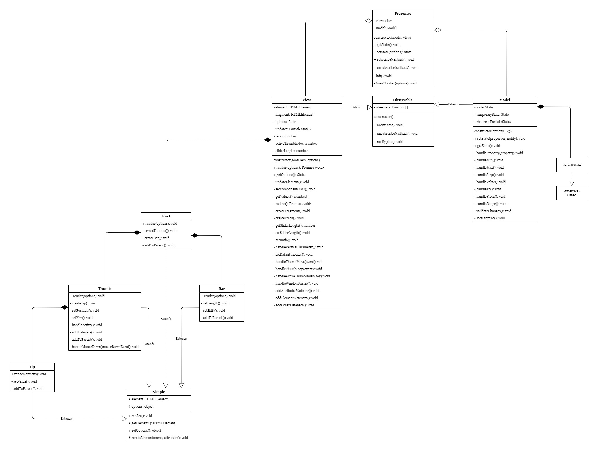

Руководство для разработчиков
===========================

##  🏷️ Содержание

- [Требования](#requirements)
- [Установка](#installation)
- [Команды](#commands)
- [Технологии](#technologies)
- [Структура проекта](#structure)
- [Архитектура слайдера](#architecture)
- [Лицензия](#license)


##  <a name="requirements"></a> ✒️ Требования

Прежде чем приступить к установке убедитесь что у вас имеются следующие компоненты списка:

- [Node.js](https://nodejs.org/en/)
- [Yarn](https://yarnpkg.com)
- [Git](https://git-scm.com/)
  

##  <a name="installation"></a> 💾 Установка

Инструкции данного раздела следует выполнять в командной строке.

```bash
# Скачайте репозиторий
git clone https://github.com/AkhmadBabaev/ordinary-slider
  
# Перейдите в папку с репозиторием
cd ordinary-slider

# Установите зависимости
yarn install
```


##  <a name="commands"></a> 📗 Команды

- `yarn dev` - запускает *development* сборку, поднимает локальный сервер с результатом сборки по адресу `http://localhost`. Не сохраняет результат в файловой системе. Детали работы в [webpack.dev.js](./config/webpack.dev.js).

- `yarn start` - дополняет команду `yarn dev` тем, что запускает ваш браузер по умолчанию (если он не запущен), создает вкладку с адресом лок. сервера и переходит к ней.

- `yarn prod` - запускает *production* сборку и сохраняет результат в папку `/docs`. Детали работы в [webpack.prod.js](./config/webpack.prod.js).

- `yarn lint` - проверяет код на соответствие параметрам указанным в [eslint](./.eslintrc.yml).  

- `yarn test` - запускает тесты.


##  <a name="technologies"></a> 🛠️ Технологии

Сборка проекта осуществляется с помощью [Webpack](https://webpack.js.org).

* Разметка: [Pug](https://pugjs.org/api/getting-started.html)
* Стили: [SCSS](https://sass-lang.com), [PostCSS](https://postcss.org), [BEM](https://ru.bem.info)
* Сценарии: [Typescript](https://www.typescriptlang.org), [ESLint](https://eslint.org/), [Babel](https://babeljs.io)
* Тесты: [Jest](https://jestjs.io)(TDD)
* Настройки редактора: [EditorConfig](https://editorconfig.org)


##  <a name="structure"></a> 🗂️ Структура проекта

 - **/src:** служит для хранения исходников.
    - **plugin:** исходники слайдера
    - **components:** компоненты для демо страницы
    - **auxiliary:** вспомогательные файлы разметки и стилей
    - **favicons:** фав-иконки

 - **/docs:** для результата сборки проекта.

 - **/config:** предназначен для конфигурационных файлов *webpack* и файлов имеющих к ним отношение.

 - **/storage:** хранилище для разного рода файлов таких как изрображеня необходимые для md файлов.


##  <a name="architecture"></a> 🗺️ Архитектура слайдера

В проекте используется архитектура MVP.

**Модель** - принимает объект состояния слайдера, обрабатывает, оптимизирует, обновляет и оповещает *представителя* об изменениях состояния.

**Вид** - отвечает за графическое отображение состояния слайдера, уведомляет *представителя* о взаимодействиях с пользователем.

**Представитель** - является связующим звеном между *моделью* и *видом*. Передает *виду* необходимые данные *модели* и наоборот.

### UML диаграмма




##  <a name="license"></a> 📃 Лицензия

Этот проект лицензирован на условиях лицензии **MIT**.

> Вы можете ознакомиться с содержанием лицензии [здесь](./LICENSE.md).
